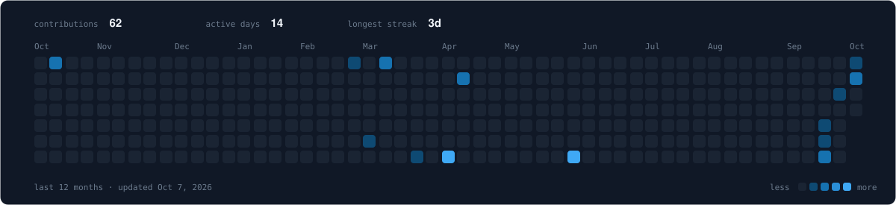

<!-- Header: change the name / tagline by editing text= and desc= below (spaces are %20) -->
<p align="center">
  
</p>

<!-- Typing line: phrases are separated by ; and spaces are + -->
<p align="center">
  
</p>

<p align="center">
  <a href="https://akash-xploit.github.io/insighter-portfolio/"></a>
  <a href="https://www.linkedin.com/in/akashkukkala/"></a>
  <a href="mailto:akash.kukkala@outlook.com"></a>
  <a href="https://medium.com/@insighter9"></a>
  <a href="https://linktr.ee/akashkukkala"></a>
  <a href="https://profile.hackthebox.com/profile/019d450d-9db9-70f8-86ce-40ce946a963e"></a>
</p>

---

### `~/profile`

```yaml
role:       Aspiring Blue Team / Cloud Security Engineer
focus:      AWS Security · Detection Engineering · SOC Operations
secondary:  DFIR · Threat Hunting · Security Monitoring

working_on: AWS Secure Vault
learning:   AWS Security, Threat Detection, and SOC Workflows
fun_fact:   I like building security projects that feel like real-world operations.

status:     [██████████░░░░░░░░░░] securing the stack
```

### `~/certifications`

<!-- Earned: 3DDC97 (green). In progress: F5B942 (amber). Spaces are _ and a real dash is -- --> 
<p>
  
  
  
  
  
</p>

### `~/skills`

<!-- To add a skill, copy a badge line and change the name. Spaces are _ -->

**Cloud & Security**<br/>


**Detection, SIEM & Monitoring**<br/>


**DFIR & Threat Analysis**<br/>


**Scripting & Automation**<br/>


**Systems, Labs & Infrastructure**<br/>


### `~/activity`

<!-- Updated automatically every day by .github/workflows/activity.yml -->


---

<p align="center">
  <code>"The attacker needs to succeed once. We need to succeed every single time.</code><br/>
  <code>So we engineer systems that make failure impossible."</code>
</p>

<p align="center">
  
</p>
